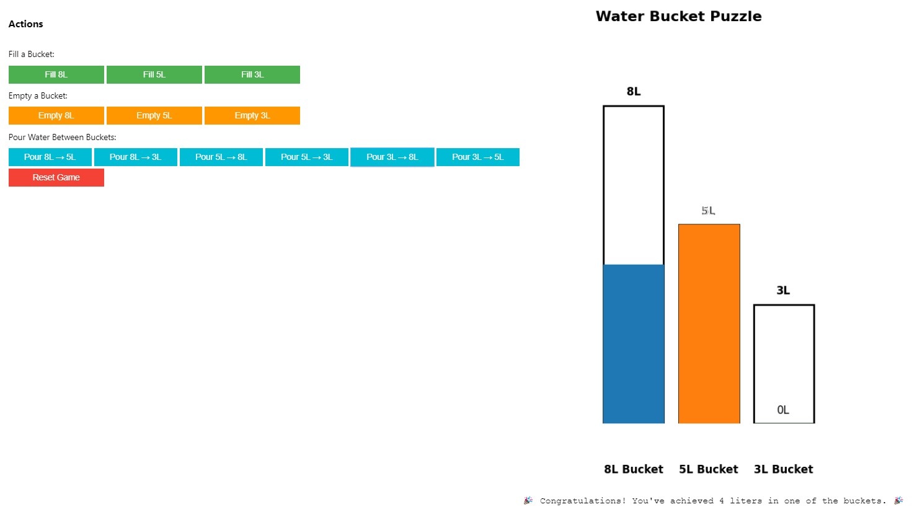

 

# Water Bucket Puzzle 🪣💧

  

## Table of Contents

- [Overview](#overview)
- [Features](#features)
- [Technologies Used](#technologies-used)
- [Getting Started](#getting-started)
  - [Prerequisites](#prerequisites)
  - [Installation](#installation)
- [Usage](#usage)
  - [Command-Line Interface](#command-line-interface)
  - [Interactive UI](#interactive-ui) 
- [Future Enhancements](#future-enhancements)
- [Contributing](#contributing)
- [License](#license)
- [Acknowledgements](#acknowledgements)
- [Contact](#contact)

## Overview

The **Water Bucket Puzzle** is a Python-based interactive game that simulates the classic water jug problem. The objective is to manipulate three buckets with capacities of 3 liters, 5 liters, and 8 liters to measure exactly 4 liters of water. This project enhances problem-solving skills and provides an engaging way to understand algorithmic thinking.

## Features

- **Interactive Command-Line Interface**: Users can **Fill**, **Empty**, and **Pour** water between buckets to achieve the desired volume.
- **Beautiful User Interface**: Utilizes **ipywidgets** and **matplotlib** to create a dynamic and visually appealing UI within **Google Colab**.
- **Real-Time Visualization**: Displays the current state of each bucket using graphical representations, updating in real-time based on user actions.
- **Type-Hinted Code**: Implements Python’s `typing` module for improved code readability and maintainability.
- **Extensible Design**: Easily modify bucket sizes or add new features, such as automated solvers using algorithms like Breadth-First Search (BFS).

## Technologies Used

- **Python**: Core programming language for developing the game's logic and functionality.
- **ipywidgets**: For building interactive UI components that make the game engaging and easy to navigate.
- **Matplotlib**: To visualize the bucket states dynamically, providing users with immediate feedback on their actions.
- **Google Colab**: Platform for developing, running, and sharing the interactive notebook, making it accessible to a wider audience.

## Getting Started

Follow these instructions to set up and run the Water Bucket Puzzle on your local machine or within Google Colab.

### Prerequisites

- **Python 3.6+**: Ensure you have Python installed. You can download it from [python.org](https://www.python.org/downloads/).
- **pip**: Python package installer.
- **Google Colab Account** *(Optional)*: For running the interactive UI in a cloud environment.

### Installation

1. **Clone the Repository**

   ```bash
   git clone https://github.com/hakhan2001/Water-Bucket-Puzzle.git
   cd Water-Bucket-Puzzle
   ```

2. **Create a Virtual Environment** *(Optional but recommended)*

   ```bash
   python -m venv venv
   source venv/bin/activate  # On Windows: venv\Scripts\activate
   ```

3. **Install Dependencies**
 
   ```bash
   pip install ipywidgets matplotlib
   ```

4. **Enable Jupyter Widgets Extension** *(For Interactive UI in Jupyter Notebooks)*

   ```bash
   jupyter nbextension enable --py widgetsnbextension
   ```

## Usage

### Command-Line Interface

Run the command-line version of the Water Bucket Puzzle directly from your terminal.

1. **Navigate to the Project Directory**

   ```bash
   cd Water-Bucket-Puzzle
   ```

2. **Run**
    Run the file of python.ipynb
   

3. **Follow the On-Screen Prompts**

   - **Fill (F)**: Fill a bucket to its maximum capacity.
   - **Empty (E)**: Empty a bucket completely.
   - **Pour (P)**: Pour water from one bucket to another.
   - **Quit (Q)**: Exit the game.

### Interactive UI

Experience the Water Bucket Puzzle with a beautiful and interactive UI using **ipywidgets** and **matplotlib** within **Google Colab**.

1. **Open Google Colab**

   Navigate to [Google Colab](https://colab.research.google.com/) and sign in with your Google account.

2. **Open the Notebook**

   Click on **`File`** > **`Open notebook`** and enter the URL to your notebook or upload it from your local machine.

3. **Run the Notebook**

   Execute each cell by clicking the **`Run`** button or pressing `Shift + Enter`. Follow the interactive prompts to play the game.

4. **Interact with the UI**

   Use the provided buttons to **Fill**, **Empty**, and **Pour** water between buckets. Watch the real-time visual updates to solve the puzzle.

 
## Future Enhancements

- **Automated Solver**: Integrate algorithms like BFS to automatically solve the puzzle and guide users through optimal steps.
- **Advanced Visuals**: Enhance the UI with more detailed graphics and animations for a richer user experience.
- **Customizable Buckets**: Allow users to define their own bucket sizes, creating varied and personalized challenges.
- **Move Counter**: Implement a counter to track the number of moves taken to solve the puzzle.
- **Solution Hints**: Provide hints or step-by-step solutions for users who are stuck.

## Contributing

Contributions are welcome! If you have suggestions, bug reports, or want to contribute new features, please follow these steps:

1. **Fork the Repository**

2. **Create a New Branch**

   ```bash
   git checkout -b feature/YourFeatureName
   ```

3. **Commit Your Changes**

   ```bash
   git commit -m "Add your message here"
   ```

4. **Push to the Branch**

   ```bash
   git push origin feature/YourFeatureName
   ```

5. **Open a Pull Request**

   Describe your changes and submit the pull request for review.

## License

This project is licensed under the [MIT License](LICENSE). You are free to use, modify, and distribute this software as per the terms of the license.

## Acknowledgements

- **Python Community**: For providing excellent libraries and resources.
- **ipywidgets Documentation**: For comprehensive guides on building interactive widgets.
- **Matplotlib Documentation**: For detailed tutorials on creating dynamic visualizations.
- **OpenAI**: For the GPT-4 model that assisted in developing project documentation.

## Contact

Hassan Ali Khan  
📧 [armanashraf015@gmail.com](mailto:armanashraf015@gmail.com)  
🔗 [GitHub - Water-Bucket-Puzzle](https://github.com/arman229/Water-Bucket-Puzzle)  
🔗 [LinkedIn](https://www.linkedin.com/in/arman-ashraf-427951219/)  

Feel free to reach out for any questions, feedback, or collaboration opportunities!

---

 